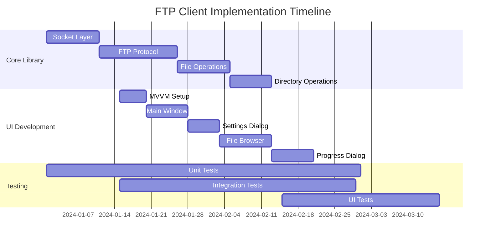

# FTP Client .NET Core Implementation Plan

## Executive Summary

This implementation plan outlines the migration of the C++ FtpClient application to .NET 9 with WPF UI, following a phased approach that prioritizes core functionality before UI components. The plan estimates 12 weeks for complete migration with a team of 3-5 engineers, including comprehensive testing and deployment preparation. The implementation leverages modern C# patterns including async/await, dependency injection, and MVVM architecture.

## Project Architecture Overview

### Technology Stack
- **.NET 9**: Latest stable framework with performance improvements
- **WPF**: Modern UI framework replacing MFC dialogs
- **System.Net.Sockets**: Async networking replacing blocking sockets
- **Microsoft.Extensions.DependencyInjection**: Built-in DI container
- **Microsoft.Extensions.Logging**: Structured logging framework
- **Microsoft.Extensions.Configuration**: JSON-based configuration
- **xUnit**: Unit testing framework
- **Moq**: Mocking framework for unit tests

### Solution Structure
```
FtpClient.sln
├── src/
│   ├── FtpClient.Core/              # Core FTP library
│   ├── FtpClient.UI/                # WPF application
│   └── FtpClient.Contracts/         # Interfaces and DTOs
├── tests/
│   ├── FtpClient.Core.Tests/        # Unit tests
│   ├── FtpClient.Integration.Tests/ # Integration tests
│   └── FtpClient.UI.Tests/          # UI tests
└── docs/
    └── api/                         # Generated API documentation
```

## Implementation Phases

### Phase 1: Core Infrastructure (Weeks 1-3)

#### 1.1 Project Setup and Architecture (Week 1)
**Deliverables:**
- Solution structure creation
- NuGet package configuration
- CI/CD pipeline setup
- Code style and analysis rules

**Tasks:**
- Create .NET 9 solution with project structure
- Configure EditorConfig and code analysis rules
- Set up GitHub Actions for CI/CD
- Establish branching strategy and PR templates

**Acceptance Criteria:**
- Solution builds successfully
- Code analysis passes without warnings
- CI pipeline executes on PR creation

**Estimated Effort:** 2 days (1 developer)

#### 1.2 Socket Abstraction Layer (Week 1-2)
**Deliverables:**
- `IFtpSocket` interface replacing `IBlockingSocket`
- Async socket implementation
- Connection management with timeouts
- Cross-platform compatibility testing

**C# Implementation:**
```csharp
public interface IFtpSocket : IDisposable
{
    Task ConnectAsync(IPEndPoint endpoint, CancellationToken cancellationToken = default);
    Task<int> SendAsync(byte[] buffer, int offset, int count, CancellationToken cancellationToken = default);
    Task<int> ReceiveAsync(byte[] buffer, int offset, int count, CancellationToken cancellationToken = default);
    Task DisconnectAsync(CancellationToken cancellationToken = default);
    bool IsConnected { get; }
}

public class FtpSocket : IFtpSocket
{
    private readonly Socket _socket;
    private readonly ILogger<FtpSocket> _logger;
    
    public async Task ConnectAsync(IPEndPoint endpoint, CancellationToken cancellationToken = default)
    {
        await _socket.ConnectAsync(endpoint, cancellationToken);
        _logger.LogInformation("Connected to {Endpoint}", endpoint);
    }
}
```

**Acceptance Criteria:**
- Socket operations are fully async
- Timeout handling works correctly
- Connection state is properly managed
- Unit tests achieve 90%+ coverage

**Estimated Effort:** 5 days (1 developer)

#### 1.3 FTP Protocol Foundation (Week 2-3)
**Deliverables:**
- `FtpCommand` and `FtpReply` classes
- Command/response parsing
- Basic FTP command execution
- Protocol state management

**C# Implementation:**
```csharp
public class FtpCommand
{
    public FtpCommandType Type { get; }
    public string[] Arguments { get; }
    
    public static FtpCommand User(string username) => new(FtpCommandType.USER, username);
    public static FtpCommand Pass(string password) => new(FtpCommandType.PASS, password);
    public static FtpCommand List(string path = null) => new(FtpCommandType.LIST, path);
}

public class FtpReply
{
    public int Code { get; }
    public string Message { get; }
    public bool IsSuccess => Code >= 200 && Code < 300;
    public bool IsIntermediate => Code >= 100 && Code < 200;
}
```

**Acceptance Criteria:**
- All 36 FTP commands are supported
- Response parsing handles multi-line replies
- Protocol state machine prevents invalid sequences
- Integration tests with real FTP server pass

**Estimated Effort:** 8 days (2 developers)

### Phase 2: Core FTP Operations (Weeks 4-6)

#### 2.1 Connection and Authentication (Week 4)
**Deliverables:**
- `IFtpClient` interface
- Connection establishment
- Authentication with firewall support
- Connection pooling and management

**C# Implementation:**
```csharp
public interface IFtpClient : IDisposable
{
    Task<bool> ConnectAsync(FtpConnectionInfo connectionInfo, CancellationToken cancellationToken = default);
    Task DisconnectAsync(CancellationToken cancellationToken = default);
    bool IsConnected { get; }
    event EventHandler<FtpCommandEventArgs> CommandSent;
    event EventHandler<FtpReplyEventArgs> ReplyReceived;
}

public class FtpClient : IFtpClient
{
    private readonly IFtpSocket _controlSocket;
    private readonly ILogger<FtpClient> _logger;
    private readonly FtpConnectionInfo _connectionInfo;
    
    public async Task<bool> ConnectAsync(FtpConnectionInfo connectionInfo, CancellationToken cancellationToken = default)
    {
        await _controlSocket.ConnectAsync(connectionInfo.EndPoint, cancellationToken);
        
        var welcomeReply = await ReceiveReplyAsync(cancellationToken);
        if (!welcomeReply.IsSuccess) return false;
        
        return await AuthenticateAsync(connectionInfo, cancellationToken);
    }
}
```

**Acceptance Criteria:**
- Anonymous and authenticated login work
- All 9 firewall types are supported
- Connection timeout handling works correctly
- Reconnection logic handles network failures

**Estimated Effort:** 6 days (2 developers)

#### 2.2 File Transfer Operations (Week 4-5)
**Deliverables:**
- Upload/download with progress reporting
- Resume capability implementation
- Active/passive mode support
- Transfer rate calculation

**C# Implementation:**
```csharp
public interface IFtpTransferService
{
    Task<bool> UploadFileAsync(string localPath, string remotePath, 
        IProgress<TransferProgress> progress = null, CancellationToken cancellationToken = default);
    Task<bool> DownloadFileAsync(string remotePath, string localPath, 
        IProgress<TransferProgress> progress = null, CancellationToken cancellationToken = default);
    Task<bool> UploadStreamAsync(Stream source, string remotePath, 
        IProgress<TransferProgress> progress = null, CancellationToken cancellationToken = default);
}

public class TransferProgress
{
    public long BytesTransferred { get; }
    public long TotalBytes { get; }
    public double PercentComplete => TotalBytes > 0 ? (double)BytesTransferred / TotalBytes * 100 : 0;
    public TimeSpan Elapsed { get; }
    public double TransferRate => Elapsed.TotalSeconds > 0 ? BytesTransferred / Elapsed.TotalSeconds : 0;
}
```

**Acceptance Criteria:**
- Large file transfers (>1GB) work reliably
- Resume functionality works after interruption
- Progress reporting is accurate and smooth
- Both active and passive modes work

**Estimated Effort:** 8 days (2 developers)

#### 2.3 Directory Operations (Week 5-6)
**Deliverables:**
- Directory listing with file information parsing
- Directory navigation (CWD, PWD, CDUP)
- Directory creation and removal
- File management operations (delete, rename, move)

**C# Implementation:**
```csharp
public interface IFtpDirectoryService
{
    Task<IEnumerable<FtpFileInfo>> ListDirectoryAsync(string path = null, CancellationToken cancellationToken = default);
    Task<string> GetCurrentDirectoryAsync(CancellationToken cancellationToken = default);
    Task<bool> ChangeDirectoryAsync(string path, CancellationToken cancellationToken = default);
    Task<bool> CreateDirectoryAsync(string path, CancellationToken cancellationToken = default);
    Task<bool> DeleteDirectoryAsync(string path, CancellationToken cancellationToken = default);
}

public class FtpFileInfo
{
    public string Name { get; }
    public long Size { get; }
    public DateTime ModifiedTime { get; }
    public bool IsDirectory { get; }
    public string Permissions { get; }
    public string Owner { get; }
    public string Group { get; }
}
```

**Acceptance Criteria:**
- LIST parsing works with major FTP server types
- File information is accurately extracted
- Directory operations handle permissions correctly
- Path handling works with different separators

**Estimated Effort:** 6 days (2 developers)

### Phase 3: Advanced Features (Weeks 7-8)

#### 3.1 Advanced Transfer Features (Week 7)
**Deliverables:**
- FXP (server-to-server) transfers
- Multiple transfer type support
- Transfer mode configuration
- Bandwidth throttling

**C# Implementation:**
```csharp
public interface IFtpAdvancedTransferService
{
    Task<bool> TransferBetweenServersAsync(IFtpClient sourceClient, string sourcePath,
        IFtpClient targetClient, string targetPath, CancellationToken cancellationToken = default);
    Task<bool> SetTransferTypeAsync(FtpTransferType type, CancellationToken cancellationToken = default);
    Task<bool> SetTransferModeAsync(FtpTransferMode mode, CancellationToken cancellationToken = default);
}

public enum FtpTransferType
{
    Ascii,
    Binary,
    Ebcdic
}
```

**Acceptance Criteria:**
- FXP transfers work between different server types
- Transfer type detection works automatically
- Bandwidth limiting functions correctly
- Error handling covers edge cases

**Estimated Effort:** 5 days (1 developer)

#### 3.2 Configuration and Logging (Week 7-8)
**Deliverables:**
- JSON-based configuration system
- Structured logging implementation
- Connection profile management
- Settings persistence

**C# Implementation:**
```csharp
public class FtpClientOptions
{
    public int DefaultTimeout { get; set; } = 30000;
    public int BufferSize { get; set; } = 8192;
    public bool EnableLogging { get; set; } = true;
    public string LogLevel { get; set; } = "Information";
    public List<FtpConnectionProfile> SavedConnections { get; set; } = new();
}

public class FtpConnectionProfile
{
    public string Name { get; set; }
    public string Hostname { get; set; }
    public int Port { get; set; } = 21;
    public string Username { get; set; }
    public bool UseFirewall { get; set; }
    public FtpFirewallType FirewallType { get; set; }
}
```

**Acceptance Criteria:**
- Configuration changes persist between sessions
- Logging provides useful debugging information
- Connection profiles can be imported/exported
- Settings validation prevents invalid configurations

**Estimated Effort:** 4 days (1 developer)

### Phase 4: User Interface (Weeks 9-12)

#### 4.1 MVVM Foundation and Main Window (Week 9)
**Deliverables:**
- MVVM framework setup
- Main application window
- Protocol output display
- Command binding infrastructure

**C# Implementation:**
```csharp
public class MainWindowViewModel : ViewModelBase
{
    private readonly IFtpClient _ftpClient;
    private readonly ObservableCollection<string> _protocolOutput = new();
    
    public ICommand BrowseCommand { get; }
    public ICommand SettingsCommand { get; }
    public ICommand ConnectCommand { get; }
    
    public ReadOnlyObservableCollection<string> ProtocolOutput { get; }
    
    public MainWindowViewModel(IFtpClient ftpClient)
    {
        _ftpClient = ftpClient;
        _ftpClient.CommandSent += OnCommandSent;
        _ftpClient.ReplyReceived += OnReplyReceived;
        
        BrowseCommand = new AsyncRelayCommand(BrowseAsync);
        SettingsCommand = new RelayCommand(ShowSettings);
    }
}
```

**XAML Implementation:**
```xml
<Window x:Class="FtpClient.UI.Views.MainWindow"
        Title="FTP Client" Width="800" Height="600">
    <Grid>
        <Grid.RowDefinitions>
            <RowDefinition Height="Auto"/>
            <RowDefinition Height="*"/>
            <RowDefinition Height="Auto"/>
        </Grid.RowDefinitions>
        
        <ToolBar Grid.Row="0">
            <Button Content="Browse Files" Command="{Binding BrowseCommand}"/>
            <Button Content="Connection Settings" Command="{Binding SettingsCommand}"/>
            <Separator/>
            <Button Content="Connect" Command="{Binding ConnectCommand}"/>
        </ToolBar>
        
        <TextBox Grid.Row="1" Text="{Binding ProtocolOutputText}" 
                 IsReadOnly="True" FontFamily="Consolas" 
                 VerticalScrollBarVisibility="Auto"/>
        
        <StatusBar Grid.Row="2">
            <StatusBarItem Content="{Binding ConnectionStatus}"/>
            <StatusBarItem Content="{Binding TransferStatus}" HorizontalAlignment="Right"/>
        </StatusBar>
    </Grid>
</Window>
```

**Acceptance Criteria:**
- Main window displays correctly
- Protocol output updates in real-time
- Commands execute without blocking UI
- Window state persists between sessions

**Estimated Effort:** 6 days (2 developers)

#### 4.2 Connection Settings Dialog (Week 9-10)
**Deliverables:**
- Connection configuration dialog
- Firewall settings with conditional visibility
- Connection profile management
- Input validation and error handling

**C# Implementation:**
```csharp
public class ConnectionSettingsViewModel : ViewModelBase
{
    private string _hostname;
    private int _port = 21;
    private string _username;
    private string _password;
    private bool _useFirewall;
    private FtpFirewallType _firewallType;
    
    public string Hostname
    {
        get => _hostname;
        set => SetProperty(ref _hostname, value);
    }
    
    public bool UseFirewall
    {
        get => _useFirewall;
        set
        {
            SetProperty(ref _useFirewall, value);
            OnPropertyChanged(nameof(FirewallSettingsVisibility));
        }
    }
    
    public Visibility FirewallSettingsVisibility => 
        UseFirewall ? Visibility.Visible : Visibility.Collapsed;
}
```

**Acceptance Criteria:**
- All connection parameters can be configured
- Firewall settings show/hide correctly
- Input validation prevents invalid entries
- Test connection functionality works

**Estimated Effort:** 5 days (1 developer)

#### 4.3 File Browser Dialog (Week 10-11)
**Deliverables:**
- Hierarchical FTP directory tree
- File/folder icons and information
- Context menu operations
- Drag-and-drop support

**C# Implementation:**
```csharp
public class FtpBrowserViewModel : ViewModelBase
{
    private readonly IFtpDirectoryService _directoryService;
    private ObservableCollection<FtpTreeNode> _rootNodes = new();
    
    public ObservableCollection<FtpTreeNode> RootNodes
    {
        get => _rootNodes;
        set => SetProperty(ref _rootNodes, value);
    }
    
    public ICommand RefreshCommand { get; }
    public ICommand SelectCommand { get; }
    
    public async Task LoadDirectoryAsync(FtpTreeNode node)
    {
        var files = await _directoryService.ListDirectoryAsync(node.FullPath);
        node.Children.Clear();
        
        foreach (var file in files)
        {
            node.Children.Add(new FtpTreeNode(file));
        }
    }
}

public class FtpTreeNode : ViewModelBase
{
    public string Name { get; }
    public string FullPath { get; }
    public bool IsDirectory { get; }
    public long Size { get; }
    public DateTime ModifiedTime { get; }
    public ObservableCollection<FtpTreeNode> Children { get; } = new();
    public ImageSource Icon => IsDirectory ? DirectoryIcon : FileIcon;
}
```

**Acceptance Criteria:**
- Tree view loads directories on demand
- File information displays correctly
- Navigation works smoothly
- Selection returns correct file paths

**Estimated Effort:** 8 days (2 developers)

#### 4.4 Progress Dialog and Transfer Management (Week 11-12)
**Deliverables:**
- Transfer progress dialog
- Real-time progress updates
- Transfer cancellation support
- Multiple transfer queue management

**C# Implementation:**
```csharp
public class TransferProgressViewModel : ViewModelBase
{
    private string _sourceFile;
    private string _targetFile;
    private double _progressPercentage;
    private string _transferRate;
    private string _timeRemaining;
    private bool _canCancel = true;
    
    public ICommand CancelCommand { get; }
    
    public void UpdateProgress(TransferProgress progress)
    {
        ProgressPercentage = progress.PercentComplete;
        TransferRate = FormatTransferRate(progress.TransferRate);
        TimeRemaining = FormatTimeRemaining(progress.EstimatedTimeRemaining);
    }
    
    private string FormatTransferRate(double bytesPerSecond)
    {
        if (bytesPerSecond < 1024) return $"{bytesPerSecond:F1} B/s";
        if (bytesPerSecond < 1024 * 1024) return $"{bytesPerSecond / 1024:F1} KB/s";
        return $"{bytesPerSecond / (1024 * 1024):F1} MB/s";
    }
}
```

**Acceptance Criteria:**
- Progress updates smoothly without flickering
- Transfer rates are calculated accurately
- Cancellation works immediately
- Multiple transfers can be managed

**Estimated Effort:** 6 days (2 developers)

## Parallel Development Opportunities

### Concurrent Work Streams

#### Stream A: Core Library (Weeks 1-6)
- Socket abstraction and FTP protocol
- File transfer operations
- Directory operations
- Can work independently of UI

#### Stream B: UI Framework (Weeks 3-8)
- MVVM infrastructure setup
- Dialog templates and styling
- Data binding and validation
- Can use mock services for development

#### Stream C: Testing and Documentation (Weeks 1-12)
- Unit test development
- Integration test setup
- API documentation
- User documentation
- Continuous throughout project

### Dependency Management



## Testing Strategy

### Unit Testing Approach
- **Target Coverage**: 90%+ for core library, 80%+ for UI ViewModels
- **Framework**: xUnit with Moq for mocking
- **Test Categories**: Fast unit tests, integration tests, UI tests

**Example Unit Test:**
```csharp
[Fact]
public async Task ConnectAsync_ValidCredentials_ReturnsTrue()
{
    // Arrange
    var mockSocket = new Mock<IFtpSocket>();
    var connectionInfo = new FtpConnectionInfo("ftp.example.com", "user", "pass");
    var ftpClient = new FtpClient(mockSocket.Object, Mock.Of<ILogger<FtpClient>>());
    
    mockSocket.Setup(s => s.ConnectAsync(It.IsAny<IPEndPoint>(), It.IsAny<CancellationToken>()))
              .Returns(Task.CompletedTask);
    
    // Act
    var result = await ftpClient.ConnectAsync(connectionInfo);
    
    // Assert
    Assert.True(result);
    mockSocket.Verify(s => s.ConnectAsync(It.IsAny<IPEndPoint>(), It.IsAny<CancellationToken>()), Times.Once);
}
```

### Integration Testing
- **Real FTP Server**: Test against FileZilla Server and IIS FTP
- **Network Conditions**: Test with various network latencies and failures
- **Large Files**: Test with files >1GB to verify memory efficiency

### UI Testing
- **Automated UI Tests**: Use Microsoft.VisualStudio.TestTools.UnitTesting.UITesting
- **Manual Testing**: User acceptance testing with real-world scenarios
- **Accessibility Testing**: Screen reader and keyboard navigation testing

## Deployment and Distribution

### Build Pipeline
```yaml
# Azure DevOps Pipeline
trigger:
  branches:
    include:
    - main
    - develop

pool:
  vmImage: 'windows-latest'

steps:
- task: UseDotNet@2
  inputs:
    version: '9.0.x'

- task: DotNetCoreCLI@2
  displayName: 'Restore packages'
  inputs:
    command: 'restore'

- task: DotNetCoreCLI@2
  displayName: 'Build solution'
  inputs:
    command: 'build'
    configuration: 'Release'

- task: DotNetCoreCLI@2
  displayName: 'Run tests'
  inputs:
    command: 'test'
    projects: '**/*Tests.csproj'
    arguments: '--configuration Release --collect:"XPlat Code Coverage"'

- task: PublishCodeCoverageResults@1
  inputs:
    codeCoverageTool: 'Cobertura'
    summaryFileLocation: '$(Agent.TempDirectory)/**/coverage.cobertura.xml'
```

### Distribution Strategy
- **ClickOnce Deployment**: For easy installation and updates
- **MSI Installer**: For enterprise deployment
- **Portable Version**: Xcopy deployment option
- **Microsoft Store**: For consumer distribution

## Risk Mitigation

### High-Risk Areas

#### 1. Async Networking Conversion
**Risk**: Performance degradation or reliability issues
**Mitigation**: 
- Extensive performance testing with large files
- Fallback mechanisms for problematic scenarios
- Gradual rollout with feature flags

#### 2. FTP Server Compatibility
**Risk**: Protocol implementation differences
**Mitigation**:
- Test matrix with major FTP server implementations
- Configurable protocol options for edge cases
- Comprehensive logging for troubleshooting

#### 3. UI/UX Modernization
**Risk**: User resistance to interface changes
**Mitigation**:
- Maintain familiar workflow patterns
- Provide classic theme option
- Comprehensive user training materials

### Medium-Risk Areas

#### 1. Cross-Platform Compatibility
**Risk**: Platform-specific networking behavior
**Mitigation**:
- Automated testing on Windows and Linux
- Platform-specific configuration options
- Community feedback during beta testing

#### 2. Performance Requirements
**Risk**: Slower than original C++ implementation
**Mitigation**:
- Performance benchmarking throughout development
- Memory profiling and optimization
- Async operation tuning

## Success Metrics

### Functional Requirements
- [ ] All existing FTP operations work identically
- [ ] Transfer speeds within 5% of C++ version
- [ ] Support same range of FTP servers
- [ ] Zero data corruption in transfers
- [ ] Resume functionality works reliably

### Non-Functional Requirements
- [ ] Application startup time < 3 seconds
- [ ] Memory usage < 100MB for typical operations
- [ ] UI responsiveness during large transfers
- [ ] Crash-free operation for 24+ hours
- [ ] Accessibility compliance (WCAG 2.1 AA)

### Quality Metrics
- [ ] Unit test coverage > 90% (core library)
- [ ] Integration test coverage > 80%
- [ ] Zero critical security vulnerabilities
- [ ] Code analysis warnings < 10
- [ ] User acceptance testing > 95% satisfaction

## Resource Requirements

### Team Composition
- **Senior .NET Developer** (1): Architecture and core library
- **Mid-Level .NET Developer** (2): Feature implementation
- **UI/UX Developer** (1): WPF interface design
- **QA Engineer** (1): Testing and validation
- **DevOps Engineer** (0.5): CI/CD and deployment

### Development Environment
- **Visual Studio 2022** or **JetBrains Rider**
- **.NET 9 SDK**
- **Git** with GitHub/Azure DevOps
- **FTP Test Servers** (FileZilla, IIS, vsftpd)
- **Performance Profiling Tools** (PerfView, dotMemory)

### Hardware Requirements
- **Development Machines**: 16GB RAM, SSD storage
- **Test Environment**: Multiple OS configurations
- **Build Servers**: Azure DevOps hosted agents
- **FTP Test Servers**: Virtual machines with various configurations

## Conclusion

This implementation plan provides a comprehensive roadmap for migrating the C++ FtpClient to .NET Core while maintaining functional parity and improving maintainability. The phased approach allows for incremental delivery and testing, reducing project risk. The parallel development streams enable efficient resource utilization, and the comprehensive testing strategy ensures quality delivery.

The estimated 12-week timeline includes appropriate buffers for testing, code review, and unexpected complexities. The modern .NET architecture will provide better performance, security, and maintainability compared to the original C++ implementation while preserving the familiar user experience.
