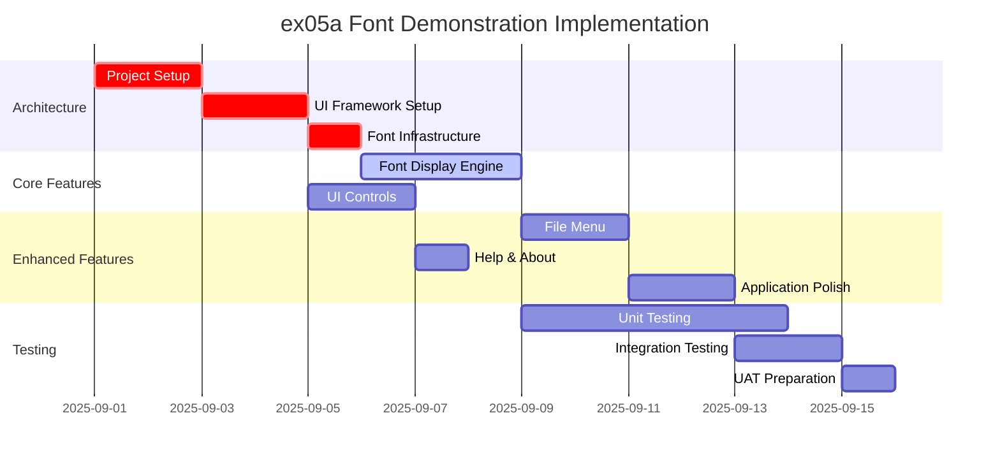
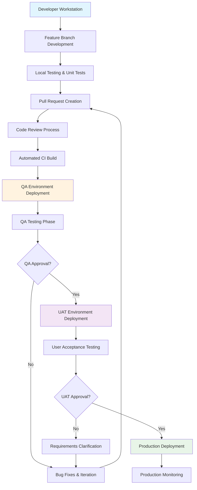

# ex05a Font Demonstration - Implementation Plan

## Executive Summary

Implementation plan for migrating the ex05a font demonstration application from MFC to .NET 9 using WPF. This is the lowest complexity migration, serving as a learning template for the team and proof of concept for the migration approach.

## Feature Implementation Order

### Phase 1: Architecture Foundation (Week 1)
**Priority**: Critical - Must complete before feature development

1. **Project Setup** (2 days)
   - Create .NET 9 WPF project structure
   - Configure dependency injection container
   - Set up logging framework (Microsoft.Extensions.Logging)
   - Configure appsettings.json for application settings

2. **UI Framework Setup** (2 days)
   - Create main window with WPF XAML
   - Implement MVVM pattern with ViewModels
   - Set up data binding infrastructure
   - Configure application resources and styles

3. **Font Management Infrastructure** (1 day)
   - Create font enumeration service
   - Implement font rendering utilities
   - Set up font property management

### Phase 2: Core Features (Week 2)
**Priority**: High - Core application functionality

4. **Font Display Engine** (3 days)
   - Implement font family enumeration
   - Create font size selection mechanism
   - Build text rendering with selected fonts
   - Add font style options (bold, italic, underline)

5. **User Interface Controls** (2 days)
   - Font family dropdown/combo box
   - Font size selector
   - Sample text display area
   - Font style checkboxes

### Phase 3: Enhanced Features (Week 3)
**Priority**: Medium - User experience improvements

6. **File Menu Implementation** (2 days)
   - New document functionality (reset to defaults)
   - Open/Save font configuration (JSON format)
   - Print preview and printing support
   - Exit application handling

7. **Help and About Features** (1 day)
   - About dialog with application information
   - Help documentation or tooltips
   - Keyboard shortcuts

8. **Application Polish** (2 days)
   - Error handling and validation
   - Application icon and branding
   - Window state persistence
   - Performance optimization

## Parallel Work Opportunities

### Can Work in Parallel:
- **Font Display Engine** and **User Interface Controls** (different developers)
- **File Menu Implementation** and **Help Features** (independent functionality)
- **Testing** can begin as soon as core features are complete

### Sequential Dependencies:
- **Project Setup** → All other features (foundation requirement)
- **UI Framework Setup** → **User Interface Controls** (UI depends on framework)
- **Font Management Infrastructure** → **Font Display Engine** (engine depends on infrastructure)

## GANTT Chart

## Feature Dependencies

### Critical Path Dependencies:
1. **Project Setup** → **UI Framework Setup** → **Font Infrastructure** → **Font Display Engine**
2. **Font Display Engine** → **Application Polish** → **Integration Testing**

### Parallel Development Streams:
- **Stream A**: Architecture → Core Font Engine → File Operations
- **Stream B**: UI Framework → UI Controls → Help Features

### Dependency Matrix:
| Feature | Depends On | Blocks |
|---------|------------|--------|
| Project Setup | None | All other features |
| UI Framework Setup | Project Setup | UI Controls, Font Display |
| Font Infrastructure | UI Framework Setup | Font Display Engine |
| Font Display Engine | Font Infrastructure | File Menu, Polish |
| UI Controls | UI Framework Setup | Integration Testing |
| File Menu | Font Display Engine | Application Polish |
| Help & About | UI Controls | None |
| Application Polish | Font Display Engine, File Menu | Integration Testing |

## Time Estimates

### Development Effort (1 Developer)
- **Total Development Time**: 15 working days (3 weeks)
- **Architecture Foundation**: 5 days
- **Core Features**: 5 days  
- **Enhanced Features**: 5 days

### Team Scaling (3-5 Engineers)
- **Parallel Development**: 2 weeks with 2 developers
- **Code Review Overhead**: +20% (3 additional days)
- **Integration Effort**: 2 days
- **Total with Team**: 2.5 weeks

### Estimate Methodology¹
**Assumptions**: Mid-level .NET developer with WPF experience, 6-8 hours productive development per day
**Complexity Factors**: Simple UI, minimal business logic, no database integration
**Risk Buffer**: 20% added for unexpected issues and learning curve
**AI Assistance**: Could reduce development time by 30-40% for code generation and debugging

## Testing Strategy

### Testing Phases

#### Phase 1: Development Testing (Ongoing)
**Responsibility**: Development Team
**Duration**: Concurrent with development

**Activities**:
- Unit testing for font management utilities
- Component testing for UI controls
- Developer smoke testing for each feature

**Tools**:
- xUnit for unit tests
- WPF Test Framework for UI component testing
- Visual Studio debugging tools

#### Phase 2: Quality Assurance Testing (1 Week)
**Responsibility**: QA Team
**Duration**: 1 week after development completion

**Test Scenarios**:
1. **Font Selection Testing**
   - Verify all system fonts are enumerated
   - Test font size selection (8pt to 72pt)
   - Validate font style combinations (bold, italic, underline)

2. **File Operations Testing**
   - Test New document (reset to defaults)
   - Test Save/Open font configuration
   - Verify print functionality

3. **UI Responsiveness Testing**
   - Test window resizing behavior
   - Verify control layout and alignment
   - Test keyboard navigation and shortcuts

4. **Error Handling Testing**
   - Test with corrupted font files
   - Test invalid configuration files
   - Verify graceful error messages

**Acceptance Criteria**:
- All fonts display correctly
- File operations work without data loss
- Application handles errors gracefully
- Performance is responsive (<1 second for font changes)

#### Phase 3: User Acceptance Testing (1 Week)
**Responsibility**: Business Users/UAT Team
**Duration**: 1 week after QA completion

**UAT Scenarios**:
1. **Business User Workflow**
   - Select different fonts for document preview
   - Save preferred font configurations
   - Print font samples for reference

2. **Usability Testing**
   - Intuitive font selection process
   - Clear visual feedback for font changes
   - Easy access to common operations

**Success Criteria**:
- Users can complete font selection tasks without training
- Application meets business requirements for font demonstration
- Performance is acceptable for typical usage patterns

## Code Development and Deployment Workflow

### Environment Pipeline

#### Development Environment
- **Purpose**: Individual developer workstations
- **Deployment**: Manual build and run
- **Testing**: Unit tests and developer smoke testing
- **Duration**: Continuous during development

#### QA Environment
- **Purpose**: Quality assurance testing
- **Deployment**: Automated CI/CD pipeline from main branch
- **Testing**: Comprehensive functional and integration testing
- **Duration**: 1 week testing cycle
- **Approval Gate**: QA sign-off required for UAT promotion

#### UAT Environment
- **Purpose**: User acceptance testing
- **Deployment**: Manual promotion after QA approval
- **Testing**: Business user validation and usability testing
- **Duration**: 1 week testing cycle
- **Approval Gate**: Business user sign-off required for production

#### Production Environment
- **Purpose**: End-user application deployment
- **Deployment**: Manual promotion after UAT approval
- **Monitoring**: Application performance and error tracking
- **Rollback**: Automated rollback capability if issues detected

### Quality Gates

1. **Code Review Gate**: All code must pass peer review before merge
2. **CI Build Gate**: All automated tests must pass before QA deployment
3. **QA Approval Gate**: Functional testing must pass before UAT deployment
4. **UAT Approval Gate**: Business acceptance required before production
5. **Production Health Gate**: Monitoring confirms successful deployment

---

¹ **Estimate Methodology**: Based on mid-level .NET developer (3-5 years experience) working 6-8 productive hours per day. Includes 20% buffer for unexpected complexity, code review overhead, and integration challenges. AI assistance could reduce development time by 30-40% through code generation, debugging support, and automated testing. Estimates assume team familiarity with WPF and .NET development patterns.

*This implementation plan provides a structured approach to migrating ex05a with clear milestones, dependencies, and quality assurance processes to ensure successful delivery.*
