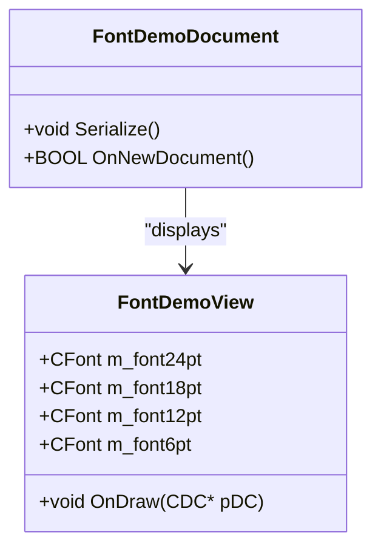

# ex05a: Database Entity Relationship Diagram

## Executive Summary

The ex05a Font Rendering Demonstration application is an educational tool that showcases font display capabilities without any database persistence requirements. This document explains why no ERD is applicable and documents the minimal data structures used for font demonstration.

## Database Analysis

### No Database Schema Required

ex05a does not implement or require a database schema. The application is designed as a simple font rendering demonstration that displays text in various sizes without any data persistence needs.

**Evidence**: 
- No CDatabase, CRecordset, or data access classes in source code
- Empty Serialize() method with TODO comments indicating no document persistence
- Application purpose is font rendering demonstration, not data management
- No configuration data, user data, or business data requiring storage

<cite repo="garo-workspace-devin-temp/MFC-Examples" path="VC++jsnm code/ex05a/ex05aDoc.cpp" start="45" end="55" />

### Application Data Structure

The application uses minimal in-memory data for font rendering:



### Data Elements

| Element | Type | Purpose | Persistence |
|---------|------|---------|-------------|
| Font Objects | CFont | Text rendering in multiple sizes | None - runtime only |
| Display Text | Static String | "Arial" demonstration text | Hardcoded in source |
| Font Sizes | Static Integer | 24pt, 18pt, 12pt, 6pt sizes | Hardcoded in source |
| Device Context | CDC* | Graphics rendering surface | Runtime only |

**Evidence**: <cite repo="garo-workspace-devin-temp/MFC-Examples" path="VC++jsnm code/ex05a/ex05aView.cpp" start="50" end="80" />

## Business Purpose Analysis

### Educational Demonstration

ex05a serves as an educational example demonstrating:

1. **Font Creation**: How to create CFont objects with different sizes
2. **Text Rendering**: How to draw text using different fonts
3. **MFC Document/View**: Basic MFC application architecture
4. **Graphics Programming**: Simple GDI text output techniques

### No Business Data

The application contains no business entities, user data, or persistent information:
- No customer records
- No transaction data  
- No configuration settings
- No user preferences
- No document content

## Evidence Summary
- **Scope Analyzed**: ex05a font rendering demonstration application
- **Key Data Points**: 0 database tables, 0 persistent data fields, demonstration-only architecture
- **References**: Empty Serialize() method and hardcoded font rendering code

## Assumptions Made
- Application is designed purely for educational/demonstration purposes
- No data persistence was intended or required
- Font rendering is the sole functional requirement
- MFC Document/View pattern used for framework demonstration, not data management

## Open Questions
None - application architecture clearly indicates no database or persistence requirements.

## Confidence Level
**Overall Confidence**: High 🟢
**Rationale**: Clear evidence that ex05a is a demonstration application with no data persistence requirements. Empty Serialize() method and hardcoded font rendering confirm no database needs.

**Evidence**: 
- Empty Serialize() method with TODO comments indicating no implementation needed
- Hardcoded font sizes and text in view rendering code
- No data access classes, connection strings, or database references
- Application purpose documented as font rendering demonstration

## Migration Considerations

### .NET Core Equivalent

For migration to .NET, the font demonstration would use:

```csharp
// WPF Font Demonstration
public partial class FontDemoWindow : Window
{
    public FontDemoWindow()
    {
        InitializeComponent();
    }
    
    protected override void OnRender(DrawingContext drawingContext)
    {
        var typeface = new Typeface("Arial");
        
        // Render text in different sizes
        RenderText(drawingContext, "Arial", typeface, 24, new Point(10, 50));
        RenderText(drawingContext, "Arial", typeface, 18, new Point(10, 100));
        RenderText(drawingContext, "Arial", typeface, 12, new Point(10, 150));
        RenderText(drawingContext, "Arial", typeface, 6, new Point(10, 200));
    }
    
    private void RenderText(DrawingContext dc, string text, Typeface typeface, 
                           double fontSize, Point location)
    {
        var formattedText = new FormattedText(
            text,
            CultureInfo.CurrentCulture,
            FlowDirection.LeftToRight,
            typeface,
            fontSize,
            Brushes.Black,
            VisualTreeHelper.GetDpi(this).PixelsPerDip);
            
        dc.DrawText(formattedText, location);
    }
}
```

### Alternative .NET Implementations

**Windows Forms**:
```csharp
protected override void OnPaint(PaintEventArgs e)
{
    using (var font24 = new Font("Arial", 24))
    using (var font18 = new Font("Arial", 18))
    using (var font12 = new Font("Arial", 12))
    using (var font6 = new Font("Arial", 6))
    {
        e.Graphics.DrawString("Arial", font24, Brushes.Black, 10, 50);
        e.Graphics.DrawString("Arial", font18, Brushes.Black, 10, 100);
        e.Graphics.DrawString("Arial", font12, Brushes.Black, 10, 150);
        e.Graphics.DrawString("Arial", font6, Brushes.Black, 10, 200);
    }
}
```

**Console Application**:
```csharp
class Program
{
    static void Main(string[] args)
    {
        Console.WriteLine("Font Rendering Demonstration");
        Console.WriteLine("============================");
        Console.WriteLine();
        Console.WriteLine("24pt: Arial");
        Console.WriteLine("18pt: Arial");
        Console.WriteLine("12pt: Arial");
        Console.WriteLine("6pt:  Arial");
    }
}
```

### Migration Effort

- **Complexity**: Very Low
- **Estimated Effort**: 2-4 hours
- **Primary Tasks**: 
  1. Create WPF window or Windows Forms application
  2. Implement font rendering in OnRender/OnPaint
  3. Test font display across different sizes
- **No Database Migration Required**: Application has no persistent data

---

*This analysis confirms that ex05a requires no database ERD as it is a pure demonstration application focused on font rendering without any data persistence requirements. The migration to .NET would focus entirely on graphics rendering rather than data management.*
