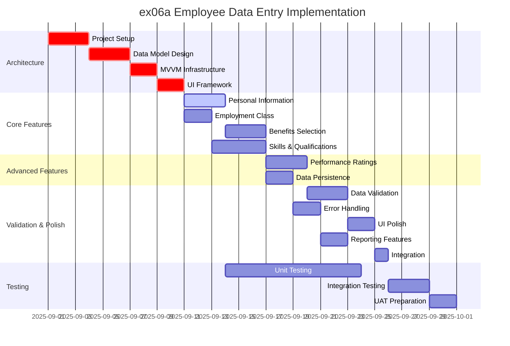
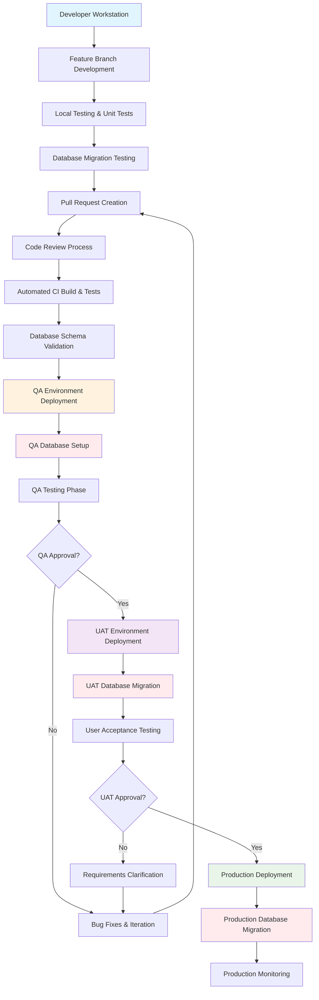

# ex06a Employee Data Entry - Implementation Plan

## Executive Summary

Implementation plan for migrating the ex06a employee data entry application from MFC to .NET 9 using WPF with Entity Framework Core. This medium-complexity migration involves comprehensive form controls, data validation, and potential database integration for persistent storage.

## Feature Implementation Order

### Phase 1: Architecture Foundation (Week 1-2)
**Priority**: Critical - Must complete before feature development

1. **Project Setup and Infrastructure** (3 days)
   - Create .NET 9 WPF project with MVVM architecture
   - Configure dependency injection (Microsoft.Extensions.DependencyInjection)
   - Set up Entity Framework Core with SQL Server
   - Configure logging framework and application settings

2. **Data Model and Database Design** (3 days)
   - Design Employee entity with proper relationships
   - Create EmployeeInsurance and EmployeeSkills entities
   - Implement Entity Framework DbContext and migrations
   - Set up database connection and initial schema

3. **MVVM Infrastructure** (2 days)
   - Create base ViewModel with INotifyPropertyChanged
   - Implement RelayCommand for button actions
   - Set up data validation with IDataErrorInfo
   - Configure ViewModelLocator and dependency injection

4. **UI Framework and Styling** (2 days)
   - Create main window layout with WPF XAML
   - Design application styles and themes
   - Set up control templates for consistent appearance
   - Configure data binding infrastructure

### Phase 2: Core Data Entry Features (Week 3-4)
**Priority**: High - Essential business functionality

5. **Personal Information Section** (3 days)
   - Name text input with validation
   - Social Security Number input with formatting and validation
   - Biography multi-line text area
   - Data binding to Employee entity

6. **Employment Classification** (2 days)
   - Hourly/Salary radio button group
   - Category selection with business rule validation
   - Integration with payroll calculation logic
   - Data binding to EmploymentCategory property

7. **Benefits Selection System** (3 days)
   - Life insurance checkbox with enrollment logic
   - Disability insurance checkbox
   - Medical insurance checkbox
   - Insurance enrollment tracking and validation

8. **Skills and Qualifications** (4 days)
   - Technical skill dropdown with predefined options
   - Education level dropdown combo
   - Department assignment list box
   - Language proficiency droplist combo
   - Skills data model and relationship management

### Phase 3: Performance and Advanced Features (Week 5)
**Priority**: Medium - Enhanced functionality

9. **Performance Rating System** (3 days)
   - Loyalty rating scroll bar (0-100 scale)
   - Reliability rating scroll bar (0-100 scale)
   - Performance grade input with validation
   - Rating calculation and display logic

10. **Data Persistence and CRUD Operations** (2 days)
    - Save employee record to database
    - Load existing employee records
    - Update employee information
    - Delete employee records with confirmation

### Phase 4: Business Rules and Validation (Week 6)
**Priority**: High - Data integrity and compliance

11. **Comprehensive Data Validation** (3 days)
    - SSN format validation (9 digits, unique)
    - Required field validation (Name, SSN, Category)
    - Range validation for performance ratings (0-100)
    - Business rule validation for employment categories

12. **Error Handling and User Feedback** (2 days)
    - Validation error display with clear messaging
    - Save/load error handling
    - User confirmation dialogs for critical actions
    - Status bar for operation feedback

### Phase 5: Application Polish and Integration (Week 7)
**Priority**: Medium - User experience and deployment

13. **Advanced UI Features** (2 days)
    - Keyboard navigation and tab order
    - Accessibility features (screen reader support)
    - Window state persistence
    - Application icon and branding

14. **Reporting and Export Features** (2 days)
    - Employee information summary report
    - Export to PDF or Excel format
    - Print employee record functionality
    - Data backup and restore capabilities

15. **Integration and Performance Optimization** (1 day)
    - Database query optimization
    - UI responsiveness improvements
    - Memory usage optimization
    - Application startup performance

## Parallel Work Opportunities

### Can Work in Parallel:
- **Personal Information Section** and **Employment Classification** (different UI areas)
- **Benefits Selection** and **Skills and Qualifications** (independent business logic)
- **Performance Rating System** and **Data Validation** (different developers)
- **UI Features** and **Reporting Features** (separate concerns)

### Sequential Dependencies:
- **Project Setup** → All development work
- **Data Model Design** → **CRUD Operations** and **Data Validation**
- **MVVM Infrastructure** → All UI development
- **Core Features** → **Advanced Features** and **Polish**

## GANTT Chart

## Feature Dependencies

### Critical Path Dependencies:
1. **Project Setup** → **Data Model** → **MVVM Infrastructure** → **Core Features**
2. **Core Features** → **Data Validation** → **Integration** → **Testing**

### Parallel Development Streams:
- **Stream A**: Architecture → Personal Info → Benefits → Performance → Validation
- **Stream B**: Architecture → Employment → Skills → Persistence → Reporting
- **Stream C**: UI Framework → Polish → Integration (can start after core features)

### Dependency Matrix:
| Feature | Depends On | Blocks | Can Parallel With |
|---------|------------|--------|-------------------|
| Project Setup | None | All features | None |
| Data Model Design | Project Setup | CRUD, Validation | UI Framework |
| MVVM Infrastructure | Data Model | All UI features | None |
| Personal Information | MVVM Infrastructure | Benefits Selection | Employment Classification |
| Employment Classification | MVVM Infrastructure | Skills & Qualifications | Personal Information |
| Benefits Selection | Personal Information | Performance Ratings | Skills & Qualifications |
| Skills & Qualifications | Employment Classification | Data Persistence | Benefits Selection |
| Performance Ratings | Benefits Selection | Data Validation | Data Persistence |
| Data Persistence | Skills & Qualifications | Error Handling | Performance Ratings |
| Data Validation | Performance Ratings | UI Polish | Error Handling |
| Error Handling | Data Persistence | Reporting | Data Validation |
| UI Polish | Data Validation | Integration | Reporting |
| Reporting | Error Handling | Integration | UI Polish |
| Integration | UI Polish, Reporting | Testing | None |

## Time Estimates

### Development Effort (1 Developer)
- **Total Development Time**: 35 working days (7 weeks)
- **Architecture Foundation**: 10 days (2 weeks)
- **Core Features**: 12 days (2.4 weeks)
- **Advanced Features**: 5 days (1 week)
- **Validation & Polish**: 8 days (1.6 weeks)

### Team Scaling (3-5 Engineers)
- **Parallel Development**: 4 weeks with 3 developers
- **Code Review Overhead**: +25% (1 additional week)
- **Integration Effort**: 3 days
- **Total with Team**: 5 weeks

### Estimate Methodology²
**Assumptions**: Mid-level .NET developer with WPF and Entity Framework experience
**Complexity Factors**: Complex form validation, database integration, business rules
**Risk Buffer**: 25% added for data migration complexity and business rule validation
**AI Assistance**: Could reduce development time by 25-35% for CRUD operations and validation logic

## Testing Strategy

### Testing Phases

#### Phase 1: Development Testing (Ongoing)
**Responsibility**: Development Team
**Duration**: Concurrent with development

**Unit Testing Focus**:
- Employee entity validation logic
- Business rule enforcement
- Data conversion and formatting
- ViewModel property validation

**Tools**:
- xUnit for unit tests
- Moq for mocking Entity Framework
- FluentAssertions for readable test assertions
- WPF Test Framework for UI components

#### Phase 2: Quality Assurance Testing (2 Weeks)
**Responsibility**: QA Team
**Duration**: 2 weeks after development completion

**Functional Test Scenarios**:

1. **Employee Data Entry Testing**
   - Create new employee with all required fields
   - Test SSN validation (format, uniqueness)
   - Verify employment category selection
   - Test benefits enrollment combinations

2. **Data Validation Testing**
   - Test required field validation
   - Verify SSN format validation (9 digits)
   - Test performance rating ranges (0-100)
   - Validate business rule enforcement

3. **Database Integration Testing**
   - Test save/load employee records
   - Verify data persistence across sessions
   - Test concurrent user scenarios
   - Validate database constraint enforcement

4. **UI Functionality Testing**
   - Test all form controls (text boxes, dropdowns, checkboxes)
   - Verify tab order and keyboard navigation
   - Test window resizing and layout
   - Validate error message display

5. **Performance Testing**
   - Test application startup time (<3 seconds)
   - Verify form responsiveness during data entry
   - Test database query performance
   - Validate memory usage under normal operation

**Acceptance Criteria**:
- All employee data saves correctly to database
- Validation prevents invalid data entry
- UI is responsive and intuitive
- No data loss during normal operations
- Application handles errors gracefully

#### Phase 3: User Acceptance Testing (2 Weeks)
**Responsibility**: HR Department/Business Users
**Duration**: 2 weeks after QA completion

**Business User Scenarios**:

1. **New Employee Onboarding**
   - HR representative enters new employee information
   - Select appropriate employment classification
   - Enroll employee in benefits programs
   - Save complete employee profile

2. **Employee Information Updates**
   - Update existing employee records
   - Modify benefits enrollment
   - Update performance ratings
   - Generate employee reports

3. **Data Quality and Compliance**
   - Verify SSN validation prevents duplicates
   - Confirm required fields enforce data completeness
   - Test business rule compliance
   - Validate audit trail for changes

**Success Criteria**:
- HR staff can complete employee entry without training
- Data quality meets compliance requirements
- Application supports typical HR workflows
- Performance is acceptable for daily use

## Code Development and Deployment Workflow

### Environment Pipeline with Database Considerations

#### Development Environment
- **Purpose**: Individual developer workstations
- **Database**: SQL Server LocalDB or Docker container
- **Deployment**: Manual build and run with Entity Framework migrations
- **Testing**: Unit tests and developer integration testing
- **Duration**: Continuous during development

#### QA Environment
- **Purpose**: Quality assurance testing
- **Database**: Dedicated SQL Server instance with test data
- **Deployment**: Automated CI/CD pipeline with database migrations
- **Testing**: Comprehensive functional, integration, and performance testing
- **Duration**: 2 weeks testing cycle
- **Data Management**: Automated test data refresh and cleanup

#### UAT Environment
- **Purpose**: User acceptance testing
- **Database**: Production-like SQL Server with sanitized production data
- **Deployment**: Manual promotion after QA approval with database migration
- **Testing**: Business user validation and workflow testing
- **Duration**: 2 weeks testing cycle
- **Data Management**: Controlled test data that mirrors production scenarios

#### Production Environment
- **Purpose**: End-user application deployment
- **Database**: Production SQL Server with full backup and recovery
- **Deployment**: Manual promotion after UAT approval with careful database migration
- **Monitoring**: Application performance, database performance, and error tracking
- **Rollback**: Database rollback plan and application rollback capability

### Quality Gates with Database Validation

1. **Code Review Gate**: Code review + database migration review
2. **CI Build Gate**: Automated tests + database migration validation
3. **QA Approval Gate**: Functional testing + database integrity validation
4. **UAT Approval Gate**: Business acceptance + data quality validation
5. **Production Health Gate**: Application monitoring + database performance monitoring

### Database Migration Strategy

#### Migration Approach
- **Entity Framework Core Migrations**: Code-first approach for schema management
- **Data Seeding**: Automated seeding of reference data (departments, skills, etc.)
- **Backup Strategy**: Full database backup before each production migration
- **Rollback Plan**: Database restore capability and application version rollback

#### Migration Testing
- **Schema Validation**: Automated testing of database schema changes
- **Data Integrity**: Validation of existing data after migration
- **Performance Testing**: Query performance validation after schema changes
- **Rollback Testing**: Verification of rollback procedures in non-production environments

---

² **Estimate Methodology**: Based on mid-level .NET developer (3-5 years experience) with WPF and Entity Framework Core knowledge, working 6-8 productive hours per day. Includes 25% buffer for complex form validation, database integration challenges, and business rule implementation. AI assistance could reduce development time by 25-35% through automated CRUD generation, validation logic templates, and Entity Framework scaffolding. Estimates assume team familiarity with MVVM patterns and modern .NET development practices.

*This implementation plan provides a comprehensive approach to migrating ex06a with detailed attention to data persistence, business rules, and user experience requirements essential for HR management applications.*
