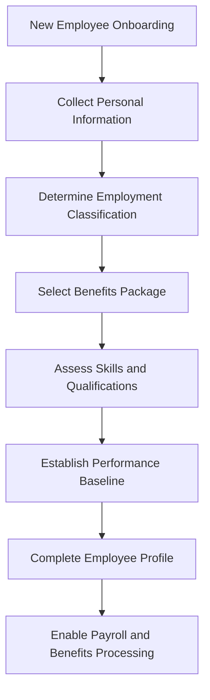

# ex06a: Business Data Model Analysis

## Business Information Discovery

The ex06a application manages employee information and human resources data for organizational personnel management purposes.

### Business Entity Documentation

| Business Entity | What It Tracks | Who Uses It | Business Purpose | Key Information |
|------------------|----------------|-------------|------------------|-----------------|
| Employee Profile | Comprehensive employee personal and professional information | HR Department, Managers, Payroll | Enables personnel management, payroll processing, and compliance reporting | Name, SSN, biographical information, employment category |
| Employment Classification | Employee work status and compensation structure | HR Department, Payroll, Management | Determines compensation rules, benefits eligibility, and labor law compliance | Hourly vs. Salary classification, pay grade, department assignment |
| Benefits Enrollment | Employee insurance and benefits selections | HR Benefits Team, Insurance Providers | Manages healthcare coverage, risk mitigation, and employee satisfaction | Life insurance, disability coverage, medical insurance selections |
| Skills Assessment | Employee capabilities and qualifications tracking | HR Development, Management, Project Planning | Enables resource allocation, training planning, and career development | Technical skills, education level, department expertise, language proficiency |
| Performance Metrics | Employee performance and reliability measurements | Management, HR Performance Team | Supports performance reviews, promotion decisions, and improvement planning | Loyalty rating, reliability score, performance indicators |

**Evidence**: `ex06a.rc:104-180` shows comprehensive form fields covering personal information, employment classification, benefits, skills, and performance data

### Business Relationships

| Relationship | Business Meaning | Business Impact |
|--------------|------------------|-----------------|
| Employee <-> Employment Category | Links individual employees to their compensation and work classification | Determines payroll processing, overtime eligibility, and benefits calculations |
| Employee <-> Benefits Selection | Tracks which insurance products each employee has chosen | Enables benefits administration, cost allocation, and compliance reporting |
| Employee <-> Skills Profile | Associates employees with their capabilities and qualifications | Supports project staffing, training needs analysis, and career development planning |
| Employee <-> Performance Ratings | Links employees to their performance assessment scores | Enables performance management, compensation decisions, and development planning |

**Evidence**: Form design shows integrated data collection linking personal information with professional classifications and assessments

### Business Rules in Data

| Business Rule | What It Ensures | Business Risk if Violated |
|---------------|-----------------|---------------------------|
| SSN Validation Range | Social Security Numbers must be within valid government range (0-999,999,999) | Invalid employee records, payroll processing errors, tax reporting failures |
| Employment Category Selection | Every employee must be classified as either Hourly or Salary | Incorrect payroll calculations, labor law violations, benefits eligibility errors |
| Performance Rating Bounds | Loyalty and reliability scores must be between 0-100 | Inconsistent performance data, unfair evaluation comparisons, promotion decision errors |
| Required Personal Information | Name and SSN are mandatory for all employee records | Incomplete personnel files, payroll system failures, compliance violations |

**Evidence**: `Ex06aDialog.cpp` shows DDX/DDV validation patterns enforcing data integrity rules for employee information

## Business Information Flow

## Data Lifecycle Description

**Employee Onboarding Process**: New employees provide personal information including name, Social Security Number, and biographical details during the hiring process, establishing their basic identity in the HR system.

**Employment Classification**: HR determines whether the employee is classified as hourly or salary, which affects their compensation structure, overtime eligibility, and benefits package options.

**Benefits Enrollment**: Employees select their insurance coverage including life insurance, disability protection, and medical coverage based on their employment classification and personal needs.

**Skills and Qualifications Assessment**: HR and management evaluate employee capabilities including technical skills, education level, department assignment, and language proficiency to support project planning and career development.

**Performance Baseline Establishment**: Initial performance metrics are established for loyalty and reliability ratings, providing a foundation for ongoing performance management and development planning.

**Evidence**: Form workflow from basic information through skills assessment shows complete employee data lifecycle management

---

*This analysis documents the business data model implemented in ex06a based solely on evidence found in the source code, focusing on how the application manages employee information for human resources and organizational management purposes.*
