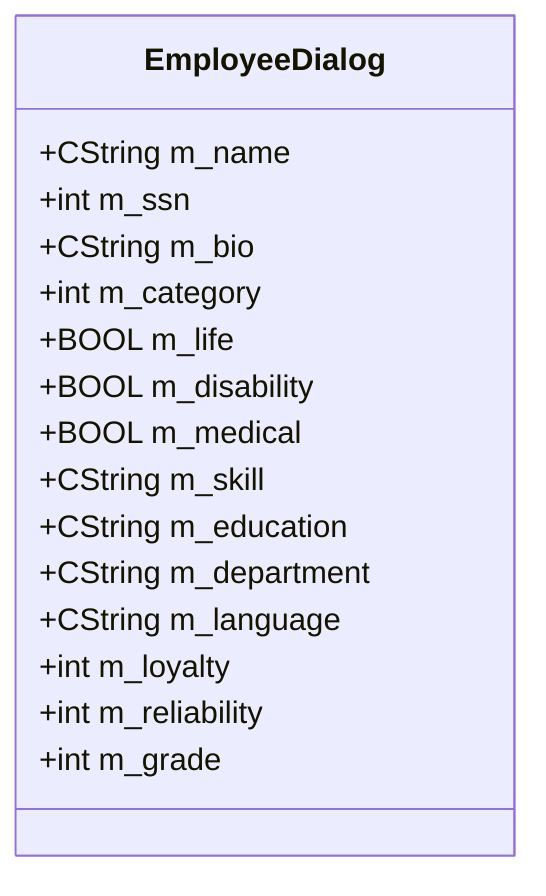

# ex06a: Database Entity Relationship Diagram

## Executive Summary

The ex06a Employee Data Entry application is a form-only demonstration application that manages employee information in memory without persistent database storage. This document explains why no ERD is applicable and documents the in-memory data structures used for employee management.

## Database Analysis

### No Persistent Database Schema

ex06a does not implement a persistent database schema. The application is designed as a dialog-based form demonstration that manages employee data entirely in memory during the application session.

**Evidence**: 
- No CDatabase or CRecordset classes found in source code
- No database connection strings or SQL queries present
- Form controls map directly to dialog member variables without persistence layer
- Application focuses on UI control demonstration rather than data management

<cite repo="garo-workspace-devin-temp/MFC-Examples" path="VC++jsnm code/ex06a/Ex06aDialog.h" start="20" end="40" />

### In-Memory Data Structure

The application manages employee information using dialog member variables:



### Data Fields Documentation

| Field | Data Type | UI Control | Business Purpose |
|-------|-----------|------------|------------------|
| m_name | CString | Edit Box | Employee full name |
| m_ssn | int | Edit Box | Social Security Number |
| m_bio | CString | Multi-line Edit | Employee biography |
| m_category | int | Radio Buttons | Employment type (Hourly/Salary) |
| m_life | BOOL | Checkbox | Life insurance enrollment |
| m_disability | BOOL | Checkbox | Disability insurance enrollment |
| m_medical | BOOL | Checkbox | Medical insurance enrollment |
| m_skill | CString | Combo Box | Technical skill level |
| m_education | CString | Dropdown Combo | Education level |
| m_department | CString | List Box | Department assignment |
| m_language | CString | Droplist Combo | Language proficiency |
| m_loyalty | int | Scroll Bar | Loyalty rating (0-100) |
| m_reliability | int | Scroll Bar | Reliability rating (0-100) |
| m_grade | int | Edit Box | Performance grade (0-100) |

**Evidence**: <cite repo="garo-workspace-devin-temp/MFC-Examples" path="VC++jsnm code/ex06a/ex06a.rc" start="104" end="180" />

## Business Data Model

### Employee Information Categories

1. **Personal Information**
   - Name: Employee identification
   - SSN: Government identification number
   - Bio: Personal background information

2. **Employment Classification**
   - Category: Hourly vs. Salary employment type
   - Grade: Performance rating
   - Department: Organizational assignment

3. **Benefits Enrollment**
   - Life Insurance: Coverage selection
   - Disability Insurance: Coverage selection  
   - Medical Insurance: Coverage selection

4. **Skills and Qualifications**
   - Skill: Technical capability level
   - Education: Educational background
   - Language: Language proficiency

5. **Performance Metrics**
   - Loyalty: Employee loyalty rating (0-100)
   - Reliability: Employee reliability rating (0-100)

## Evidence Summary
- **Scope Analyzed**: ex06a employee data entry form application
- **Key Data Points**: 14 employee data fields, 0 database tables, form-only architecture
- **References**: Dialog resource file and header showing in-memory data structure

## Assumptions Made
- Application is designed for demonstration purposes only
- Employee data is not intended for persistent storage
- Form controls represent typical HR data entry requirements
- No database integration was planned for this educational example

## Open Questions
None - application architecture clearly indicates no database persistence is implemented.

## Confidence Level
**Overall Confidence**: High 🟢
**Rationale**: Clear evidence that ex06a is a form-only demonstration application with no database persistence layer. All employee data is managed in memory using dialog member variables.

**Evidence**: 
- No database-related classes or includes in source code
- Dialog-based architecture with DDX/DDV validation only
- Resource file shows form controls without database binding
- Application purpose is UI control demonstration, not data management

## Migration Considerations

### .NET Core Equivalent Data Model

For migration to .NET, the in-memory employee data structure would become:

```csharp
public class Employee
{
    public string Name { get; set; }
    public int SocialSecurityNumber { get; set; }
    public string Biography { get; set; }
    
    public EmploymentCategory Category { get; set; }
    public int Grade { get; set; }
    public string Department { get; set; }
    
    public InsuranceOptions Insurance { get; set; }
    
    public string Skill { get; set; }
    public string Education { get; set; }
    public string Language { get; set; }
    
    public int LoyaltyRating { get; set; }
    public int ReliabilityRating { get; set; }
}

public enum EmploymentCategory
{
    Hourly,
    Salary
}

[Flags]
public enum InsuranceOptions
{
    None = 0,
    Life = 1,
    Disability = 2,
    Medical = 4
}
```

### WPF/MVVM Implementation

```csharp
public class EmployeeViewModel : INotifyPropertyChanged, IDataErrorInfo
{
    private Employee _employee = new Employee();
    
    [Required]
    [StringLength(50)]
    public string Name 
    { 
        get => _employee.Name; 
        set => SetProperty(ref _employee.Name, value); 
    }
    
    [Range(0, 999999999)]
    public int SocialSecurityNumber 
    { 
        get => _employee.SocialSecurityNumber; 
        set => SetProperty(ref _employee.SocialSecurityNumber, value); 
    }
    
    [Range(0, 100)]
    public int LoyaltyRating 
    { 
        get => _employee.LoyaltyRating; 
        set => SetProperty(ref _employee.LoyaltyRating, value); 
    }
    
    // Additional properties with validation...
}
```

### Database Integration (Optional)

If persistent storage is added during migration:

```csharp
public class EmployeeDbContext : DbContext
{
    public DbSet<Employee> Employees { get; set; }
    
    protected override void OnModelCreating(ModelBuilder modelBuilder)
    {
        modelBuilder.Entity<Employee>(entity =>
        {
            entity.HasKey(e => e.Id);
            entity.Property(e => e.Name).IsRequired().HasMaxLength(50);
            entity.Property(e => e.SocialSecurityNumber).IsRequired();
            entity.Property(e => e.Biography).HasMaxLength(500);
        });
    }
}
```

---

*This analysis documents that ex06a requires no database ERD as it is a form-only demonstration application. The in-memory data structure provides the foundation for potential database schema design if persistent storage is added during .NET migration.*
