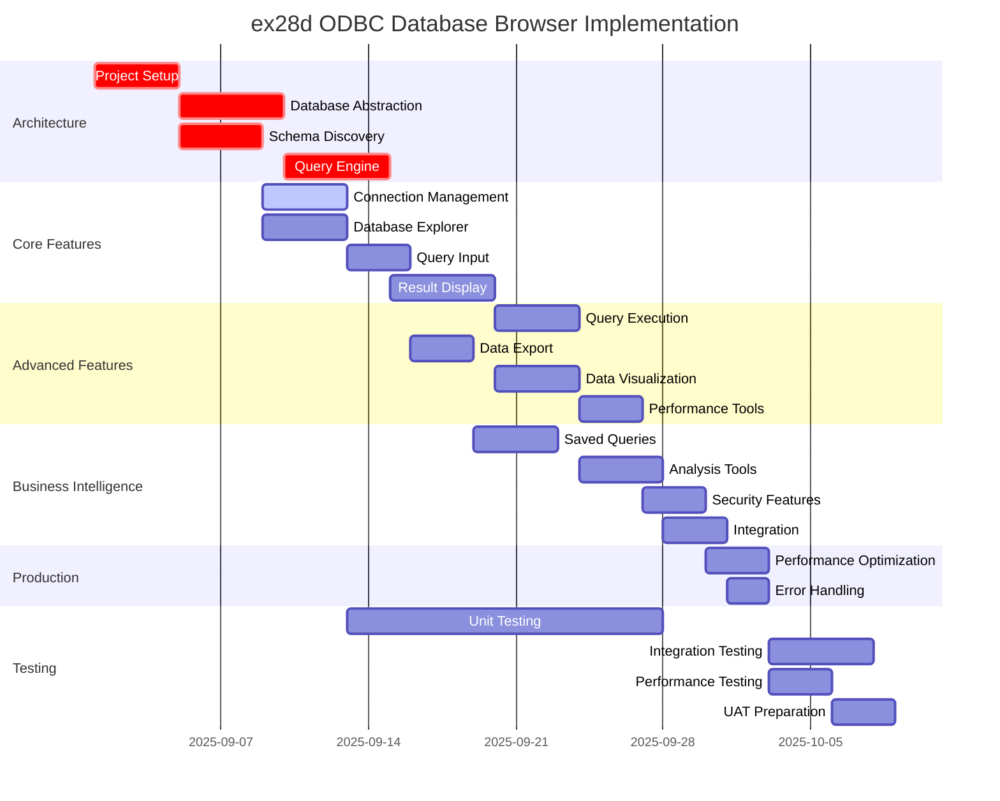
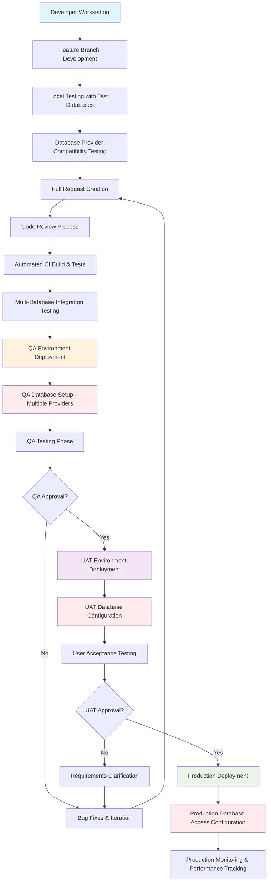

# ex28d ODBC Database Browser - Implementation Plan

## Executive Summary

Implementation plan for migrating the ex28d ODBC database browser from MFC to .NET 9 using WPF with Entity Framework Core and dynamic database connectivity. This high-complexity migration involves universal database connectivity, dynamic query execution, and real-time data visualization for business intelligence purposes.

## Feature Implementation Order

### Phase 1: Architecture Foundation (Week 1-3)
**Priority**: Critical - Complex foundation required for dynamic database access

1. **Project Setup and Core Infrastructure** (4 days)
   - Create .NET 9 WPF project with Clean Architecture pattern
   - Configure dependency injection with Microsoft.Extensions.DependencyInjection
   - Set up logging framework with Serilog for structured logging
   - Configure application settings and connection string management

2. **Database Abstraction Layer** (5 days)
   - Design IDataConnectionService interface for multiple database types
   - Implement Entity Framework Core with multiple providers (SQL Server, Oracle, MySQL)
   - Create dynamic DbContext factory for runtime database selection
   - Implement connection string builder and validation

3. **Dynamic Schema Discovery** (4 days)
   - Create database metadata discovery service
   - Implement table enumeration across different database types
   - Build column metadata extraction (names, types, constraints)
   - Design relationship discovery for foreign keys

4. **Query Engine Architecture** (5 days)
   - Design IQueryExecutionService for dynamic SQL execution
   - Implement parameterized query builder with SQL injection protection
   - Create result set abstraction for different data types
   - Build query performance monitoring and timeout handling

### Phase 2: Core Database Connectivity (Week 4-5)
**Priority**: High - Essential database browser functionality

5. **Connection Management System** (4 days)
   - Database connection dialog with provider selection
   - Connection string builder UI for different database types
   - Connection testing and validation
   - Connection pooling and lifecycle management

6. **Database Explorer Interface** (4 days)
   - Tree view for database hierarchy (databases → tables → columns)
   - Table selection and metadata display
   - Schema information panel with table details
   - Refresh and reload capabilities for schema changes

7. **Query Input and Validation** (3 days)
   - SQL query text editor with syntax highlighting
   - Query validation and error detection
   - Query history and favorites management
   - Template queries for common operations

8. **Result Set Display Engine** (5 days)
   - Dynamic data grid for query results
   - Column auto-sizing and formatting
   - Data type-specific rendering (dates, numbers, text)
   - Large result set handling with pagination

### Phase 3: Advanced Query Features (Week 6-7)
**Priority**: Medium - Enhanced functionality for power users

9. **Query Execution Management** (4 days)
   - Asynchronous query execution with cancellation
   - Progress indication for long-running queries
   - Query timeout configuration and handling
   - Multiple concurrent query support

10. **Data Export and Reporting** (3 days)
    - Export results to CSV, Excel, JSON formats
    - Print preview and printing for result sets
    - Report generation with query metadata
    - Scheduled query execution (future enhancement)

11. **Advanced Data Visualization** (4 days)
    - Data filtering and sorting in result grid
    - Column statistics and data profiling
    - Basic charting for numeric data
    - Data comparison tools

12. **Query Performance Tools** (3 days)
    - Query execution plan display
    - Performance metrics and timing
    - Query optimization suggestions
    - Database performance monitoring

### Phase 4: Business Intelligence Features (Week 8-9)
**Priority**: Medium - Value-added features for business users

13. **Saved Queries and Workspaces** (4 days)
    - Query library with categorization
    - Workspace management for different projects
    - Query sharing and collaboration features
    - Version control for query evolution

14. **Data Analysis Tools** (4 days)
    - Cross-database query capabilities
    - Data relationship discovery and visualization
    - Basic ETL operations for data movement
    - Data quality assessment tools

15. **Security and Access Control** (3 days)
    - User authentication and authorization
    - Database access permission management
    - Audit logging for query execution
    - Sensitive data masking capabilities

16. **Integration and Automation** (3 days)
    - Command-line interface for automated queries
    - REST API for external system integration
    - Batch query execution capabilities
    - Integration with business intelligence tools

### Phase 5: Performance and Production Readiness (Week 10)
**Priority**: High - Production deployment requirements

17. **Performance Optimization** (3 days)
    - Query result caching for repeated queries
    - Connection pooling optimization
    - Memory management for large result sets
    - UI responsiveness improvements

18. **Error Handling and Resilience** (2 days)
    - Comprehensive error handling for database failures
    - Connection retry logic with exponential backoff
    - Graceful degradation for partial system failures
    - User-friendly error messages and recovery guidance

## Parallel Work Opportunities

### Can Work in Parallel:
- **Database Abstraction Layer** and **Dynamic Schema Discovery** (different architectural concerns)
- **Connection Management** and **Query Input Validation** (independent UI components)
- **Result Display Engine** and **Query Execution Management** (separate developers)
- **Data Export** and **Data Visualization** (different feature sets)
- **Security Features** and **Performance Optimization** (separate concerns)

### Sequential Dependencies:
- **Project Setup** → All development work
- **Database Abstraction** → **Connection Management** and **Query Engine**
- **Schema Discovery** → **Database Explorer** and **Query Validation**
- **Core Features** → **Advanced Features** → **Production Readiness**

## GANTT Chart

## Feature Dependencies

### Critical Path Dependencies:
1. **Project Setup** → **Database Abstraction** → **Query Engine** → **Core Features**
2. **Core Features** → **Advanced Features** → **Business Intelligence** → **Production**

### Parallel Development Streams:
- **Stream A**: Architecture → Connection Management → Query Execution → Saved Queries → Performance
- **Stream B**: Architecture → Schema Discovery → Database Explorer → Analysis Tools → Security
- **Stream C**: Query Engine → Result Display → Data Visualization → Integration → Error Handling

### Dependency Matrix:
| Feature | Depends On | Blocks | Can Parallel With |
|---------|------------|--------|-------------------|
| Project Setup | None | All features | None |
| Database Abstraction | Project Setup | Connection Mgmt, Query Engine | Schema Discovery |
| Schema Discovery | Project Setup | Database Explorer, Query Input | Database Abstraction |
| Query Engine | Database Abstraction | Result Display, Query Execution | Schema Discovery |
| Connection Management | Schema Discovery | Query Input | Database Explorer |
| Database Explorer | Schema Discovery | Analysis Tools | Connection Management |
| Query Input | Connection Management | Data Export | Result Display |
| Result Display | Query Engine | Data Visualization, Query Execution | Query Input |
| Query Execution | Result Display | Performance Tools | Data Export |
| Data Export | Query Input | Saved Queries | Data Visualization |
| Data Visualization | Result Display | Analysis Tools | Data Export |
| Performance Tools | Query Execution | Security Features | Saved Queries |
| Saved Queries | Data Export | Integration | Analysis Tools |
| Analysis Tools | Data Visualization, Database Explorer | Integration | Saved Queries |
| Security Features | Performance Tools | Performance Optimization | Integration |
| Integration | Saved Queries, Analysis Tools | Error Handling | Security Features |
| Performance Optimization | Security Features | Testing | Error Handling |
| Error Handling | Integration | Testing | Performance Optimization |

## Time Estimates

### Development Effort (1 Developer)
- **Total Development Time**: 50 working days (10 weeks)
- **Architecture Foundation**: 18 days (3.6 weeks)
- **Core Features**: 16 days (3.2 weeks)
- **Advanced Features**: 14 days (2.8 weeks)
- **Business Intelligence**: 14 days (2.8 weeks)
- **Production Readiness**: 5 days (1 week)

### Team Scaling (3-5 Engineers)
- **Parallel Development**: 6 weeks with 4 developers
- **Code Review Overhead**: +30% (2 additional weeks)
- **Integration Effort**: 1 week
- **Total with Team**: 9 weeks

### Estimate Methodology³
**Assumptions**: Senior .NET developer with Entity Framework and database experience
**Complexity Factors**: Dynamic database connectivity, multiple database providers, complex UI
**Risk Buffer**: 30% added for database compatibility issues and performance optimization
**AI Assistance**: Could reduce development time by 20-30% for CRUD operations and UI generation

## Testing Strategy

### Testing Phases

#### Phase 1: Development Testing (Ongoing)
**Responsibility**: Development Team
**Duration**: Concurrent with development

**Unit Testing Focus**:
- Database connection abstraction layer
- Query parsing and validation logic
- Result set transformation and formatting
- Schema discovery algorithms

**Integration Testing Focus**:
- Multiple database provider compatibility
- Query execution across different database types
- Connection pooling and lifecycle management
- Performance under various load conditions

**Tools**:
- xUnit for unit tests
- Testcontainers for database integration testing
- Moq for mocking database connections
- NBomber for performance testing

#### Phase 2: Quality Assurance Testing (3 Weeks)
**Responsibility**: QA Team
**Duration**: 3 weeks after development completion

**Database Compatibility Testing**:

1. **Multi-Database Provider Testing**
   - Test connectivity to SQL Server, Oracle, MySQL, PostgreSQL
   - Verify schema discovery across different database types
   - Test query execution with provider-specific SQL syntax
   - Validate data type handling and conversion

2. **Query Functionality Testing**
   - Test simple SELECT queries across all supported databases
   - Verify complex JOIN queries with multiple tables
   - Test parameterized queries and SQL injection protection
   - Validate query timeout and cancellation functionality

3. **Performance and Scalability Testing**
   - Test with large result sets (>100K rows)
   - Verify memory usage with concurrent connections
   - Test query performance with complex database schemas
   - Validate connection pooling under load

4. **Data Export and Visualization Testing**
   - Test export to CSV, Excel, JSON formats
   - Verify data integrity in exported files
   - Test chart generation with various data types
   - Validate print functionality for large result sets

5. **Error Handling and Recovery Testing**
   - Test behavior with invalid connection strings
   - Verify handling of database connection failures
   - Test recovery from network interruptions
   - Validate error messages for various failure scenarios

**Acceptance Criteria**:
- Successfully connects to all supported database types
- Query execution completes within acceptable time limits
- Data export maintains integrity and formatting
- Application handles errors gracefully without crashes
- Performance meets requirements for typical business use

#### Phase 3: User Acceptance Testing (3 Weeks)
**Responsibility**: Business Analysts and Database Administrators
**Duration**: 3 weeks after QA completion

**Business User Scenarios**:

1. **Database Analysis Workflow**
   - Connect to production databases for analysis
   - Explore database schema and table relationships
   - Execute ad-hoc queries for business reporting
   - Export results for further analysis in Excel

2. **Cross-Database Reporting**
   - Connect to multiple database systems
   - Execute queries across different data sources
   - Compare data between development and production
   - Generate reports combining data from multiple systems

3. **Performance Monitoring and Optimization**
   - Monitor query execution performance
   - Identify slow-running queries and optimization opportunities
   - Analyze database schema for performance improvements
   - Generate performance reports for database administrators

**Success Criteria**:
- Business analysts can perform database analysis without technical assistance
- Database administrators can use tool for performance monitoring
- Application supports typical business intelligence workflows
- Query performance is acceptable for interactive use
- Data export capabilities meet business reporting requirements

## Code Development and Deployment Workflow

### Environment Pipeline with Multi-Database Support

#### Development Environment
- **Purpose**: Individual developer workstations
- **Databases**: Docker containers with SQL Server, MySQL, PostgreSQL for testing
- **Deployment**: Manual build and run with local database connections
- **Testing**: Unit tests and developer integration testing across multiple providers
- **Duration**: Continuous during development

#### QA Environment
- **Purpose**: Quality assurance testing
- **Databases**: Dedicated instances of all supported database types with test data
- **Deployment**: Automated CI/CD pipeline with database provider validation
- **Testing**: Comprehensive functional, performance, and compatibility testing
- **Duration**: 3 weeks testing cycle
- **Data Management**: Automated test data refresh across all database types

#### UAT Environment
- **Purpose**: User acceptance testing
- **Databases**: Production-like instances with sanitized production data
- **Deployment**: Manual promotion after QA approval
- **Testing**: Business user validation with real-world database scenarios
- **Duration**: 3 weeks testing cycle
- **Data Management**: Controlled access to production-like data sources

#### Production Environment
- **Purpose**: End-user application deployment
- **Databases**: Production database access with appropriate security controls
- **Deployment**: Manual promotion after UAT approval with security validation
- **Monitoring**: Application performance, database connection health, query performance
- **Security**: Encrypted connections, audit logging, access control validation

### Quality Gates with Database Security

1. **Code Review Gate**: Code review + database security review
2. **CI Build Gate**: Automated tests + multi-database compatibility validation
3. **QA Approval Gate**: Functional testing + database performance validation
4. **UAT Approval Gate**: Business acceptance + data security validation
5. **Production Health Gate**: Application monitoring + database access monitoring

### Database Security and Access Management

#### Security Approach
- **Connection String Encryption**: Secure storage of database credentials
- **Role-Based Access**: User permissions based on database access requirements
- **Audit Logging**: Complete logging of all database queries and connections
- **Data Masking**: Automatic masking of sensitive data in non-production environments

#### Access Control
- **Authentication**: Integration with corporate authentication systems
- **Authorization**: Database-specific permission management
- **Monitoring**: Real-time monitoring of database access and query execution
- **Compliance**: Audit trails for regulatory compliance requirements

---

³ **Estimate Methodology**: Based on senior .NET developer (5+ years experience) with Entity Framework Core and multi-database experience, working 6-8 productive hours per day. Includes 30% buffer for database provider compatibility issues, performance optimization challenges, and complex UI requirements. AI assistance could reduce development time by 20-30% through automated code generation for database providers, query builders, and UI components. Estimates assume team familiarity with Clean Architecture patterns and enterprise database development.

*This implementation plan provides a comprehensive approach to migrating ex28d with detailed attention to database connectivity, performance, security, and business intelligence requirements essential for enterprise database browser applications.*
