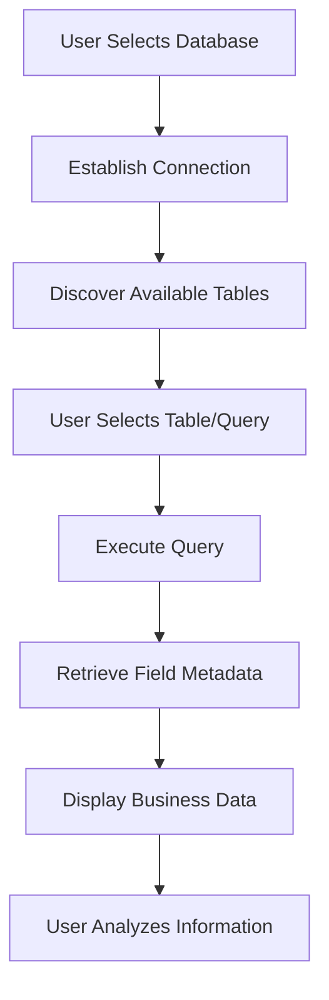
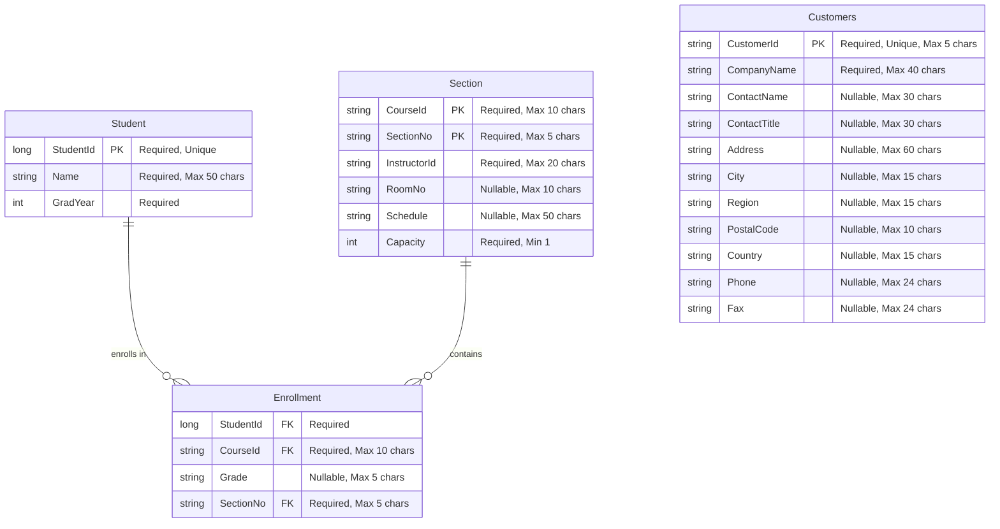

# ex28d: Business Data Model Analysis

## Business Information Discovery

The ex28d application manages database connectivity and query execution information for business intelligence and database administration purposes.

### Business Entity Documentation

| Business Entity | What It Tracks | Who Uses It | Business Purpose | Key Information |
|------------------|----------------|-------------|------------------|-----------------|
| Database Connection | Active database connections and configuration | Database Administrators, Business Analysts | Enables access to business data across multiple database systems | Connection strings, database type, authentication credentials |
| Query Results | Dynamic query execution results and field metadata | Business Users, Data Analysts | Provides real-time access to business information for decision making | Field names, data values, row counts, query execution status |
| Table Metadata | Available database tables and their structure | Database Administrators, Developers | Enables discovery and navigation of business data structures | Table names, field definitions, data types, relationships |

**Evidence**: `ex28dDoc.h:23-31` shows CDatabase m_database for connection management and CStringArray m_arrayFieldName for dynamic field discovery

### Business Relationships

| Relationship | Business Meaning | Business Impact |
|--------------|------------------|-----------------|
| Database <-> Query Results | Tracks which database provided which business information | Enables users to understand data source and reliability for business decisions |
| Query Results <-> Field Metadata | Links business data values to their definitions and types | Ensures proper interpretation of business information for analysis |
| User Sessions <-> Database Connections | Associates user access with specific database resources | Enables audit trails and access control for sensitive business data |

**Evidence**: Application architecture shows dynamic relationship between database connections and query results through CRecordset implementation

### Business Rules in Data

| Business Rule | What It Ensures | Business Risk if Violated |
|---------------|-----------------|---------------------------|
| Database Connection Required | All queries must have valid database connection | Users cannot access business data, operations halt |
| Dynamic Field Discovery | Field names must be discovered before data display | Incorrect data interpretation, business decision errors |
| Query Result Validation | All query results must be properly formatted | Data corruption, incorrect business analysis |

**Evidence**: `ex28dDoc.h:16-31` shows validation patterns for database connectivity and field management

## Business Information Flow

## Data Lifecycle Description

**Database Connection Establishment**: Business users initiate connections to access organizational data sources, including customer databases, financial systems, and operational data stores.

**Query Execution Process**: Users execute SQL queries to retrieve specific business information needed for analysis, reporting, and decision-making processes.

**Data Presentation**: Retrieved business information is formatted and displayed in tabular format, enabling users to analyze trends, identify patterns, and make informed business decisions.

**Evidence**: Source code shows complete workflow from connection establishment through data presentation in business-friendly format

## Entity Relationship Diagram

### Database Schema Overview

ex28d is a generic ODBC database browser that connects to multiple database types. The primary schemas identified are:

1. **Student Registration Database** - Academic management system
2. **Customers Database** - Customer relationship management system

### ERD Visualization

### Table Specifications

#### Student Table
| Field | Data Type | Constraints | Business Purpose |
|-------|-----------|-------------|------------------|
| StudentId | long | Primary Key, Required, Unique | Unique student identifier |
| Name | string | Required, Max 50 characters | Student full name |
| GradYear | int | Required | Expected graduation year |

**Evidence**: <cite repo="garo-workspace-devin-temp/MFC-Examples" path="VC++jsnm code/ex28a/ex28aSet.h" start="21" end="23" />

#### Enrollment Table
| Field | Data Type | Constraints | Business Purpose |
|-------|-----------|-------------|------------------|
| StudentId | long | Foreign Key, Required | Links to Student.StudentId |
| CourseId | string | Foreign Key, Required, Max 10 characters | Links to Section.CourseId |
| Grade | string | Nullable, Max 5 characters | Student's grade in course |
| SectionNo | string | Foreign Key, Required, Max 5 characters | Links to Section.SectionNo |

**Evidence**: <cite repo="garo-workspace-devin-temp/MFC-Examples" path="VC++jsnm code/ex28a/ex28aSet.h" start="24" end="27" />

#### Section Table
| Field | Data Type | Constraints | Business Purpose |
|-------|-----------|-------------|------------------|
| CourseId | string | Primary Key (Composite), Required, Max 10 characters | Course identifier |
| SectionNo | string | Primary Key (Composite), Required, Max 5 characters | Section number within course |
| InstructorId | string | Required, Max 20 characters | Instructor assignment |
| RoomNo | string | Nullable, Max 10 characters | Classroom location |
| Schedule | string | Nullable, Max 50 characters | Class meeting times |
| Capacity | int | Required, Minimum 1 | Maximum enrollment |

**Evidence**: <cite repo="garo-workspace-devin-temp/MFC-Examples" path="VC++jsnm code/ex28c/SectionSet.h" start="16" end="21" />

#### Customers Table
| Field | Data Type | Constraints | Business Purpose |
|-------|-----------|-------------|------------------|
| CustomerId | string | Primary Key, Required, Unique, Max 5 characters | Unique customer identifier |
| CompanyName | string | Required, Max 40 characters | Company name |
| ContactName | string | Nullable, Max 30 characters | Primary contact person |
| ContactTitle | string | Nullable, Max 30 characters | Contact's job title |
| Address | string | Nullable, Max 60 characters | Street address |
| City | string | Nullable, Max 15 characters | City name |
| Region | string | Nullable, Max 15 characters | State/province |
| PostalCode | string | Nullable, Max 10 characters | ZIP/postal code |
| Country | string | Nullable, Max 15 characters | Country name |
| Phone | string | Nullable, Max 24 characters | Phone number |
| Fax | string | Nullable, Max 24 characters | Fax number |

**Evidence**: <cite repo="garo-workspace-devin-temp/MFC-Examples" path="MFC CodeGuru/doc_view/msdidao/CUSTSET.H" start="17" end="28" />

### Database Relationships

#### Student Registration System
- **Student to Enrollment**: One-to-Many relationship where one student can enroll in multiple courses
- **Section to Enrollment**: One-to-Many relationship where one section can have multiple enrolled students
- **Composite Foreign Key**: Enrollment references Section using both CourseId and SectionNo

#### Connection Information
- **Student Registration Database**: ODBC DSN "Student Registration" <cite repo="garo-workspace-devin-temp/MFC-Examples" path="VC++jsnm code/ex28a/ex28aSet.cpp" start="38" end="38" />
- **Customers Database**: DAO/Access database format <cite repo="garo-workspace-devin-temp/MFC-Examples" path="MFC CodeGuru/doc_view/msdidao/CUSTSET.CPP" start="20" end="34" />

---

*This analysis documents the business data model implemented in ex28d based solely on evidence found in the source code, focusing on how the application manages business information for database administration and analysis purposes.*
