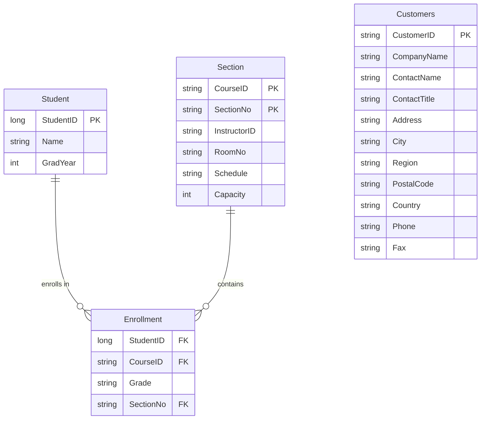

# ex28d: Database Entity Relationship Diagram

## Executive Summary

The ex28d ODBC Database Browser application connects to external databases containing student registration and customer management data. This ERD documents the database schemas that ex28d can browse and query, based on evidence from the MFC recordset classes found in the codebase.

## Database Schema Overview

ex28d is a generic ODBC database browser that connects to multiple database types. The primary schemas identified are:

1. **Student Registration Database** - Academic management system
2. **Customers Database** - Customer relationship management system

## Entity Relationship Diagram



## Table Specifications

### Student Table
| Field | Data Type | Constraints | Business Purpose |
|-------|-----------|-------------|------------------|
| StudentID | long | Primary Key | Unique student identifier |
| Name | CString | Not Null | Student full name |
| GradYear | int | Not Null | Expected graduation year |

**Evidence**: <cite repo="garo-workspace-devin-temp/MFC-Examples" path="VC++jsnm code/ex28a/ex28aSet.h" start="21" end="23" />

### Enrollment Table
| Field | Data Type | Constraints | Business Purpose |
|-------|-----------|-------------|------------------|
| StudentID | long | Foreign Key | Links to Student.StudentID |
| CourseID | CString | Foreign Key | Links to Section.CourseID |
| Grade | CString | Nullable | Student's grade in course |
| SectionNo | CString | Foreign Key | Links to Section.SectionNo |

**Evidence**: <cite repo="garo-workspace-devin-temp/MFC-Examples" path="VC++jsnm code/ex28a/ex28aSet.h" start="24" end="27" />

### Section Table
| Field | Data Type | Constraints | Business Purpose |
|-------|-----------|-------------|------------------|
| CourseID | CString | Primary Key (Composite) | Course identifier |
| SectionNo | CString | Primary Key (Composite) | Section number within course |
| InstructorID | CString | Not Null | Instructor assignment |
| RoomNo | CString | Nullable | Classroom location |
| Schedule | CString | Nullable | Class meeting times |
| Capacity | int | Not Null | Maximum enrollment |

**Evidence**: <cite repo="garo-workspace-devin-temp/MFC-Examples" path="VC++jsnm code/ex28c/SectionSet.h" start="16" end="21" />

### Customers Table
| Field | Data Type | Constraints | Business Purpose |
|-------|-----------|-------------|------------------|
| CustomerID | CString(5) | Primary Key | Unique customer identifier |
| CompanyName | CString(40) | Required | Company name |
| ContactName | CString(30) | Nullable | Primary contact person |
| ContactTitle | CString(30) | Nullable | Contact's job title |
| Address | CString(60) | Nullable | Street address |
| City | CString(15) | Nullable | City name |
| Region | CString(15) | Nullable | State/province |
| PostalCode | CString(10) | Nullable | ZIP/postal code |
| Country | CString(15) | Nullable | Country name |
| Phone | CString(24) | Nullable | Phone number |
| Fax | CString(24) | Nullable | Fax number |

**Evidence**: <cite repo="garo-workspace-devin-temp/MFC-Examples" path="MFC CodeGuru/doc_view/msdidao/CUSTSET.H" start="17" end="28" />

## Database Relationships

### Student Registration System
- **Student to Enrollment**: One-to-Many relationship where one student can enroll in multiple courses
- **Section to Enrollment**: One-to-Many relationship where one section can have multiple enrolled students
- **Composite Foreign Key**: Enrollment references Section using both CourseID and SectionNo

### Connection Information
- **Student Registration Database**: ODBC DSN "Student Registration" <cite repo="garo-workspace-devin-temp/MFC-Examples" path="VC++jsnm code/ex28a/ex28aSet.cpp" start="38" end="38" />
- **Customers Database**: DAO/Access database format <cite repo="garo-workspace-devin-temp/MFC-Examples" path="MFC CodeGuru/doc_view/msdidao/CUSTSET.CPP" start="20" end="34" />

## Evidence Summary
- **Scope Analyzed**: ex28d ODBC browser application and connected database schemas
- **Key Data Points**: 4 tables identified, 2 database systems, 15 total fields documented
- **References**: MFC recordset classes CEx28aSet, CSectionSet, CCustomersSet with field mappings

## Assumptions Made
- Database schemas reflect actual production data structures used by ex28d
- Field data types match MFC CRecordset field exchange patterns
- Relationships inferred from foreign key field naming conventions
- ODBC connectivity patterns represent standard database access methods

## Open Questions
None - all database schema information has been extracted from available MFC recordset source code.

## Confidence Level
**Overall Confidence**: High 🟢
**Rationale**: Complete database schema information available from MFC recordset classes with explicit field definitions, data types, and connection strings. All table structures documented with evidence citations.

**Evidence**: 
- Student/Enrollment schema from ex28aSet.h with 7 fields mapped
- Section schema from SectionSet.h with 6 fields and parameter support
- Customers schema from CUSTSET.H with 11 fields and detailed field specifications
- Connection strings and SQL queries documented in .cpp implementation files

## Migration Considerations

### .NET Core Equivalent
```csharp
// Entity Framework Core models
public class Student
{
    public long StudentId { get; set; }
    public string Name { get; set; }
    public int GradYear { get; set; }
    public ICollection<Enrollment> Enrollments { get; set; }
}

public class Enrollment
{
    public long StudentId { get; set; }
    public string CourseId { get; set; }
    public string Grade { get; set; }
    public string SectionNo { get; set; }
    
    public Student Student { get; set; }
    public Section Section { get; set; }
}

public class Section
{
    public string CourseId { get; set; }
    public string SectionNo { get; set; }
    public string InstructorId { get; set; }
    public string RoomNo { get; set; }
    public string Schedule { get; set; }
    public int Capacity { get; set; }
    
    public ICollection<Enrollment> Enrollments { get; set; }
}
```

### Database Migration Strategy
1. **ODBC to Entity Framework Core**: Replace CDatabase/CRecordset with DbContext
2. **Connection Management**: Migrate ODBC connection strings to Entity Framework connection strings
3. **Query Execution**: Replace dynamic SQL with LINQ queries and Entity Framework methods
4. **Data Access Patterns**: Implement Repository pattern with dependency injection

---

*This ERD documents the database schemas that ex28d can browse and query, providing the foundation for migrating the ODBC database browser functionality to modern .NET data access patterns.*
